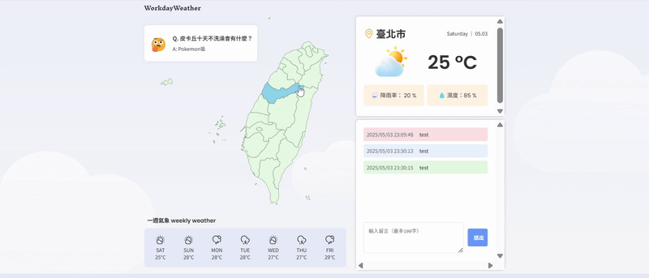
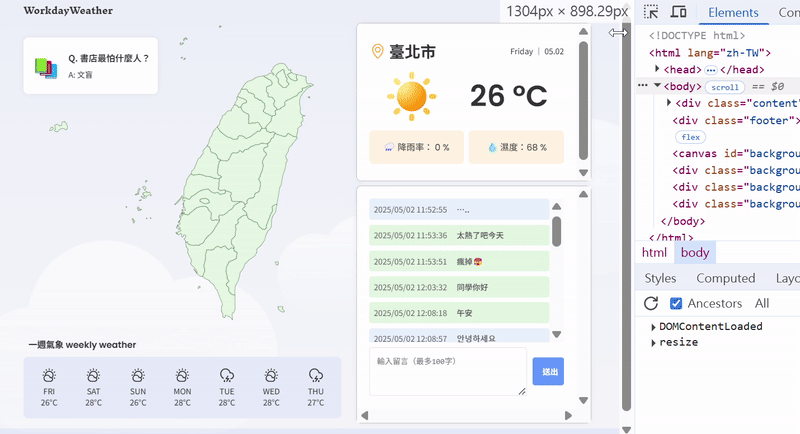

# Workday Weather - 即時天氣與聊天室互動平台

[](https://oceanlover2024.github.io/WorkdayWeather/)

**線上體驗 Demo:** [https://oceanlover2024.github.io/WorkdayWeather/](https://oceanlover2024.github.io/WorkdayWeather/)

_（後端部署於 Render 免費方案，若初次載入或聊天室回應較慢，請稍候幾秒鐘讓服務喚醒）_

## 專案簡介

「Workday Weather」是一個結合**即時天氣查詢**與**匿名聊天室**的網頁應用程式。設計初衷源於許多上班族每日出門前查看天氣的習慣，我們希望將單純的天氣資訊查詢，轉化為一個更具互動性與人情味的平台。

使用者不僅可以透過點擊互動式地圖快速獲取台灣各縣市的即時天氣與未來一週預報（資料來源：中央氣象署開放資料平台），還能進入一個基於 **Server-Sent Events (SSE)** 技術的即時聊天室。在這裡，使用者可以匿名分享當下的天氣心情、生活趣事或任何想說的話，營造出輕鬆自在的線上交流空間。

我們期望「Workday Weather」能成為上班族每日早晨的一個小小慰藉，在關心天氣的同時，也能感受到人與人之間短暫而溫暖的連結。





## 團隊貢獻

本專案由三人協作完成，旨在模擬真實開發情境，展現團隊合作與技術整合能力。**專案進度與方向主要透過團隊定期會議共同討論決定。** 各成員主要貢獻如下：

- **丁綾葳 - 專案組長 / 後端開發 (Project Lead / Backend Developer):**
  - 主導後端架構設計，並負責所有 Python 程式碼實作 (FastAPI 路由、服務邏輯、資料模型)。
  - 實現 Server-Sent Events (SSE) 伺服器端機制，確保訊息即時、單向推送至客戶端 (`services/message_service.py`, `routers/stream.py`)。
  - 利用 `asyncio` 開發跨日訊息自動清理的背景任務 (`services/message_service.py`)。
  - 負責前後端應用程式的部署策略與執行 (Render / GitHub Pages)。
  - 配置 CORS 策略，解決跨域資源共享問題 (`main.py`)。
  - 參與團隊會議，協調技術實現與專案方向。
- **邵佳渝 - 前端開發 (介面設計與實作) (Frontend Developer - UI Design & Implementation):**
  - 負責前端使用者介面的**規劃、設計**與實作，包含 HTML 結構、CSS 樣式及整體視覺風格。
  - 實現 SVG 互動地圖的渲染與點擊交互邏輯，觸發天氣資訊更新。
  - 實現前端使用者介面相關的 JavaScript 邏輯，如隨機笑話、天氣圖示切換、Canvas 下雨動畫效果 (`ui.js`)。
  - 確保響應式網頁設計 (RWD) 在不同裝置上的視覺一致性與可用性。
  - 參與團隊會議，貢獻介面設計方案與使用者體驗建議。
- **蕭郁蓁 - 前端開發 (邏輯與整合) (Frontend Developer - Logic & Integration):**
  - 負責串接中央氣象署 Open API，包含資料請求、解析與前端狀態管理 (`weatherNow.js`, `weatherWeek.js`)。
  - 整合前端與後端聊天室 API，實現訊息的發送 (`POST /api/message`)、歷史訊息載入 (`GET /api/messages`)。
  - 實現 SSE 客戶端邏輯 (`EventSource`)，監聽並處理後端推送事件 (`GET /api/stream`)，確保聊天室即時更新 (`chat.js`)。
  - 撰寫並維護專案說明文件 (README)。
  - 參與團隊會議，確保前後端邏輯順暢整合。

## 功能特色

- **🗺️ 互動式地圖查詢：** 點擊 SVG 台灣地圖上的縣市，立即顯示該地區天氣資訊。
- **☀️ 即時天氣資訊：** 顯示選定縣市的當前天氣狀況（溫度、濕度、天氣描述、降雨機率）。
- **📅 一週天氣預報：** 提供未來七天的天氣預報概覽（白天為主），並根據所選縣市動態更新。
- **💧 動態天氣視覺：**
  - 根據天氣狀況顯示對應的圖示。
  - 遇到降雨天氣時，背景會自動播放 Canvas 製作的下雨動畫效果。
- **💬 即時聊天室：**
  - 透過 SSE 技術實現低延遲的即時訊息推送，提升用戶互動體驗。
  - 訊息暫存於後端記憶體 (`collections.deque`, 最多 50 則)。
  - 每日自動清空聊天記錄，呼應氣象資訊的時效性特點，同時確保系統資源最佳化。
  - 基本 XSS 防護：對使用者輸入進行 HTML 實體逸脫處理。
  - 訊息時間戳：自動附加訊息發送時的伺服器時間 (台北時區)。
- **😂 上班族小確幸：** 頁面包含隨機顯示的冷笑話，與台灣早餐店飲料封膜笑話的文化連結，增添趣味。
- **📱 響應式網頁設計 (RWD)：** 確保在不同尺寸的裝置上皆有良好的瀏覽體驗。

## 技術棧

- **前端 (Frontend):**
  - HTML5, CSS3, JavaScript (ES6+)
  - Fetch API (用於與後端及氣象 API 通訊)
  - EventSource API (用於 SSE 客戶端)
  - Canvas API (用於下雨動畫)
  - SVG (用於互動式地圖)
- **後端 (Backend):**
  - Python 3
  - FastAPI (高效能 Web 框架)
  - Uvicorn (ASGI 伺服器)
  - Pydantic (資料驗證與模型定義)
  - `asyncio` (處理非同步操作與背景任務)
  - `collections.deque` (用於聊天訊息的記憶體內儲存)
- **資料來源 (Data Source):**
  - 中央氣象署開放資料平台 API
    - `F-D0047-089`: 鄉鎮天氣預報-未來 3 天
    - `F-D0047-091`: 鄉鎮天氣預報-未來 1 週
- **部署 (Deployment):**
  - 前端：GitHub Pages
  - 後端：Render

## 架構概觀

- **使用者介面 (Frontend):** 使用者透過部署在 GitHub Pages 上的靜態網頁 (HTML/CSS/JS) 與應用互動。
- **天氣資料獲取:** 前端 JavaScript (`weatherNow.js`, `weatherWeek.js`) 直接呼叫中央氣象署的 Open API，獲取並處理即時與一週天氣資料，由 `ui.js` 渲染到畫面上。
- **聊天室互動 (Backend):**
  - 前端 (`chat.js`) 透過 `fetch` 向部署在 Render 上的 FastAPI 後端發送 `POST /api/message` 請求來提交新訊息。
  - 後端 (`routers/message.py`, `services/message_service.py`) 驗證訊息，添加時間戳，存入記憶體中的 `deque`。
  - 新訊息儲存後，後端 (`services/message_service.py`) 透過 SSE 連線 (`GET /api/stream` 由 `routers/stream.py` 處理) 將新訊息 (`new_message` 事件) 推送給所有已連接的前端客戶端。
  - 前端 (`chat.js`) 初次載入時，透過 `fetch` 發送 `GET /api/messages` 請求獲取當前所有歷史訊息。
  - 前端 (`chat.js`) 透過 `EventSource` 監聽來自 `GET /api/stream` 的 SSE 事件 (`new_message`, `clear_message`)，並呼叫 `ui.js` 中的函數即時更新聊天室畫面。
- **背景任務 (Backend):** FastAPI 後端 (`main.py`, `services/message_service.py`) 運行一個 `asyncio` 背景任務，定時檢查是否跨日 (台北時區)。若跨日，則清空 `deque` 中的訊息，並透過 SSE 推送 `clear_message` 事件。

## API 端點 (聊天室)

以下為後端 FastAPI 提供的聊天室相關 API 端點：

- **`POST /api/message`**

  - **說明:** 發布一則新訊息。
  - **請求 Body (JSON):**
    ```json
    {
      "text": "想說的話..."
    }
    ```
  - **驗證:** `text` 不可為空或僅含空白，長度不可超過 100 字。
  - **成功回應 (200 OK):**
    ```json
    {
      "status": "success",
      "data": {
        "text": "想說的話...",
        "time": "YYYY/MM/DD HH:MM:SS"
      }
    }
    ```
  - **失敗回應 (400 Bad Request / 500 Internal Server Error):**
    ```json
    {
      "status": "error",
      "data": null,
      "message": "錯誤訊息說明"
    }
    ```

- **`GET /api/messages`**

  - **說明:** 獲取當前儲存的所有聊天訊息列表 (最多 50 則，按時間排序)。
  - **成功回應 (200 OK):**
    ```json
    {
      "status": "success",
      "data": [
        { "text": "訊息一", "time": "時間一" },
        { "text": "訊息二", "time": "時間二" },
        ...
      ]
    }
    ```
  - **失敗回應 (500 Internal Server Error):**
    ```json
    {
      "status": "error",
      "data": null,
      "message": "伺服器錯誤訊息"
    }
    ```

- **`GET /api/stream`**
  - **說明:** 建立 Server-Sent Events (SSE) 連線，用於即時接收新訊息和清除通知。
  - **回應類型:** `text/event-stream`
  - **事件 (Events):**
    - `event: new_message`
      `data: {"text": "新訊息內容", "time": "訊息時間"}`
    - `event: clear_message`
      `data: {}`

## 測試

在開發過程中，我們採用以下測試方法確保功能正常運作：

- **手動功能測試:**

  - 前端各功能點的互動體驗測試。
  - 跨瀏覽器相容性簡易檢查 (主要在 Chrome 開發，確保在 Firefox、Safari 等瀏覽器上可用)。
  - 行動裝置響應式佈局測試。

- **API 測試:**
  - 使用 curl 命令行工具對所有後端 API 端點進行基本功能驗證。
  - 檢測邊界條件如空訊息處理、長訊息限制等。
